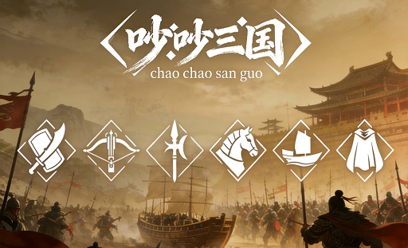
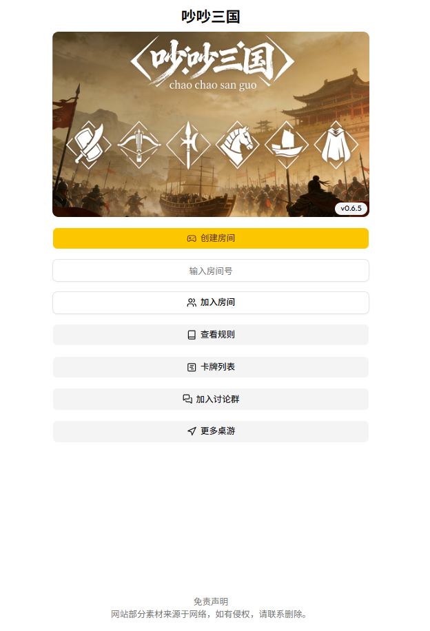
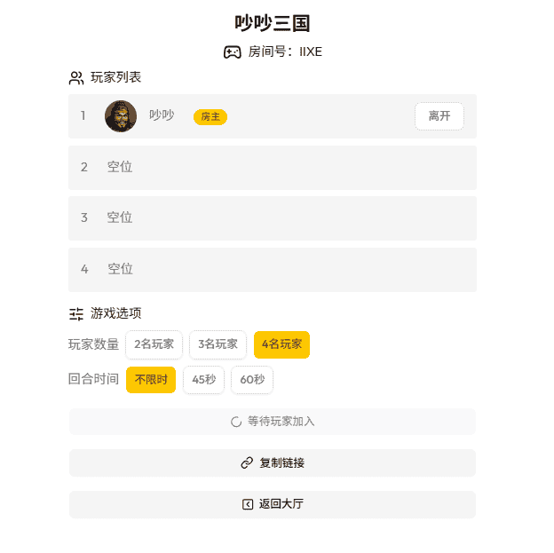
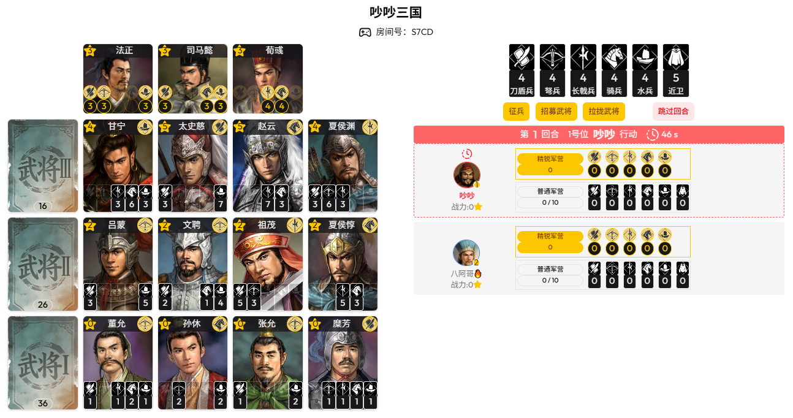
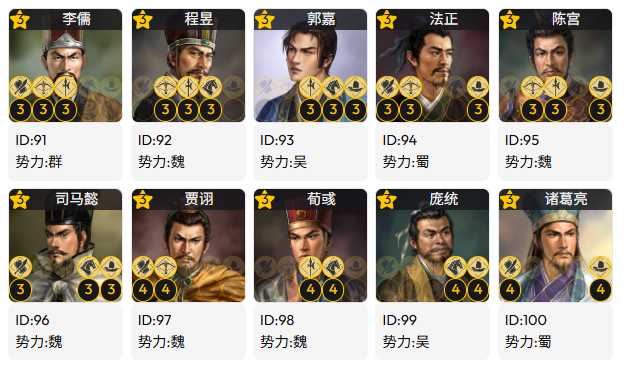
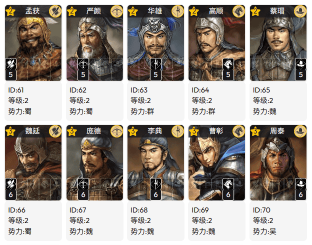
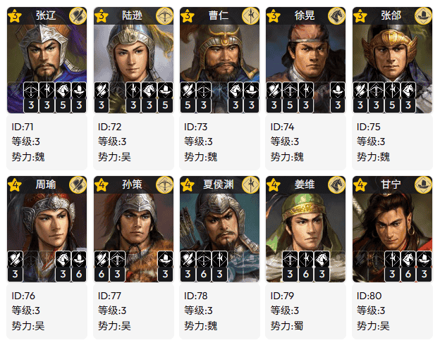
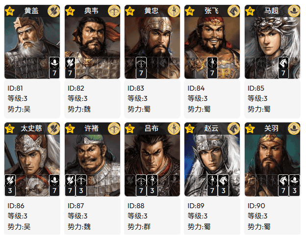

<p align="center">
  <br>
  <br>
  <a href="https://ccsg.chaochaoyx.com" target="_blank" rel="noopener noreferrer">
    <picture>
      
    </picture>
  </a>
  <br>
  <br>
</p>
<br/>

# 吵吵三国 🔥

> 复刻“璀璨宝石”、命名卡牌资源、增强代入感、便于沟通交流

> 《吵吵三国》是一款充满策略与竞争的在线桌游，支持2-4人联机游玩。在游戏中，玩家们扮演三国时期虚拟势力，通过征兵、招募武将和获得谋士辅佐，争夺成为战力最强的势力。

- 本地部署、分享好友
- 规则简单、上手容易
- 无需注册、下载
- 打开浏览器游玩
- 适配手机、Pad、PC

**也可点击[吵吵三国【官方网站】](https://ccsg.chaochaoyx.com)即刻开玩！！！**

## 快速部署

使用Docker一行命令完成部署

```
docker run -d -p 8080:80 --name chaochaosanguo chaochaokeji/chaochaosanguo:latest
```

部署成功后，浏览器输入[http://localhost:8080](http://localhost:8080)开始桌游。

## 游戏截图

### 首页截图



### 房间截图



### 游戏截图



## 游玩规则

### 上手规则

每位玩家轮流操作一个回合。

每个回合你只可以选择一个操作：

`【征兵】`

你可以选择征3个兵（不同兵种），或者选择征2个兵（相同兵种）。

`【招募武将】`

武将卡牌：下方显示的为招募需求的兵力，左上方为武将战力，右上为武将拥有的精锐兵力。

你的兵力满足条件即可招募武将，消耗对应兵力，精锐兵力不消耗。

`【拉拢武将】`

你可以拉拢武将，获得武将的近卫。近卫可以充当任何一种兵种。

率先到达15战力的玩家即获胜！

**好了，了解这些，你就可以开启群雄争霸之旅了！**

### 完整规则

#### 游戏元素

游戏界面依次为：谋士、武将、全国可征兵力、玩家势力。

`【兵种】`

游戏分为6个兵种，分别是刀盾兵、弩兵、长戟兵、骑兵、水兵及近卫。数字“1”代表1K兵力。

前5个兵种（刀盾兵、弩兵、长戟兵、骑兵、水兵）通过征兵获得，每局游戏每个普通兵种全国可征兵力数量为玩家数量加2。

最后1个兵种（近卫）通过拉拢武将获取，每局游戏全国可征兵力共有5，近卫可用于代替任意一兵种。

`【兵力】`

兵力分为普通兵力和精锐兵力，普通兵力通过征兵获得，驻扎在普通军营（容量上限10）；精锐兵力通过招募武将获得，驻扎在精锐军营（不限量）。

`【武将】`

武将分为3个等级，“I级”武将40位，“II级”武将30位，“III级”武将20位，战力由低到高。

`【谋士】`

谋士共有10位。每局游戏谋士数量为玩家数量加1，其它谋士本局不再出现。

玩家势力精锐兵力达到谋士需求兵力时会出山辅佐玩家势力。

#### 胜利目标

玩家势力需要通过招募武将、获得谋士辅佐提升战力。

当有势力战力达到或超过15时，进入“最后回合”，回合内所有势力操作完毕，最终战力最高的势力获胜。（如果战力一致，精锐兵力少的玩家获胜。）

#### 游戏流程

各个势力轮流行动，每个回合可以做以下4种操作之一：征兵、招募武将、拉拢武将、跳过回合。

`【征兵】`

势力可以选择3个兵种各征兵1，或者选择1个兵种征兵2（该兵种全国可征兵力至少为4）。

`【招募武将】`

玩家势力兵力（普通+精锐）达到武将需求兵力时方可招募该武将。招募武将后，全国可征兵力同步增加。

`【拉拢武将】`

玩家势力拉拢武将后获得1近卫兵力（若有可征兵力），该武将只能由本方势力招募。每个势力最多可拉拢3位武将。

`【跳过回合】`

玩家势力不做任何操作。

## 游戏资料

### 谋士

谋士共有10位：



### 武将

武将分为3个等级，“I级”武将40位，“II级”武将30位，“III级”武将20位，战力由低到高。

以下仅部分武将：





## 下步计划

- 水友赛功能，方便小伙伴组织小型比赛
- 管理后台模块，自己添加广告等功能
- 添加游戏动效及操作记录
- ...

## 建议反馈

欢迎小伙伴多多提出修改意见，项目将不断发展完善。

## 支持

如果你喜欢该项目，可以捐赠支持，万分感谢！！！
<br/>
<br/>

<p align="center">

</p>
